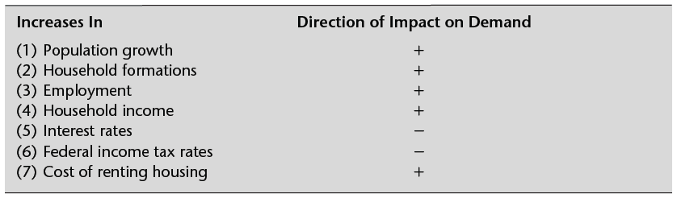

```{r setup, include=FALSE}
knitr::opts_chunk$set(echo = TRUE)


library(FinCal)
library(png)
library(grid)
table <- readPNG("housing_demand.png", native = TRUE)
```

## Urban Planning and Development


```{r fig, out.width="300 px", echo=FALSE}

# grid.raster(table)


```
