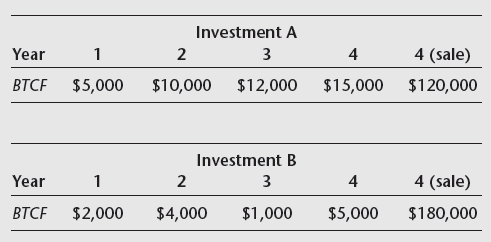
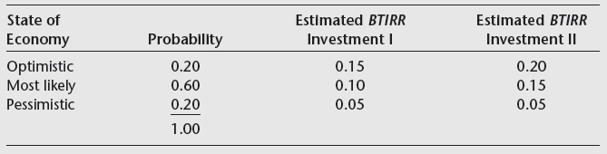
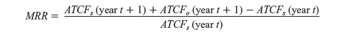

```{r setup, include=FALSE}
knitr::opts_chunk$set(echo = TRUE)


library(FinCal)
library(png)
library(grid)
table <- readPNG("housing_demand.png", native = TRUE)
```

## Urban Planning and Development

Factors influencing on housing demand:

```{r fig, out.width="300 px", echo=FALSE}

# grid.raster(table)
knitr::include_graphics("housing_demand.png")

```

## Risk analysis

Changes in demand affect returns and increase investments risks. 

Evaluating risk by examining the expected return:

- IRR under favourable and unfavourable scenarios.
- Partitioning IRR to analyze risk factors.

## "Real options" approach 

Reducing risk by not fully commiting to invest all capital at one point in time.

- Developer can purchase a parcel of land, but keep the decision of when to construct (given current and expected market conditions).
- Development project can also be partially constructed.

The developer can decide to wait for improved market conditions, reducing investment risk. The lower risk is captured in the value of land.^[see presentation slides]

## Land valuation under "real options" approach

\normalsize

Land developed faces the option to develop her land today, or in one year. She uses the real options approach to help decide when to construct:

- Compute current value of land (using the residual method).
- Consider that the land is developed, and the market may follow two scenarios: Optimistic and pessimistic (in which conditions are the same as today).


## Land valuation under "real options" approach (continued)

\normalsize

- Compare the scenarios with a situation in which the land was not developed, and instead the developer invested in a "replicate" portfolio. The portfolio consists of $\alpha$ housing units and $\beta$ shares of risk free assets. $\alpha$ and $\beta$ are determined in a way that reflects the return for both scenarions.

$$ V = \alpha*P + \beta $$ 
Where $V$ is the value of land, $P$ is the price per constructed unit.

- Use $\alpha$ and $\beta$ to calculate the value of a replicate portfolio and compare it with current expected return (no construction). Use this value to support the decision of whether to build or not.


## Land valuation under "real options" approach (Example)

Land value = units*(price - cost).

Scenario   | price  | units | costs  | Land value | Interest
-----------+--------+-------+--------+------------+---------
Current    | 0.29M  | 10    | 0.17M  | 1.20M       | 4\%
Optimistic | 0.33M  | 15    | 0.19M  | 2.10M       | 4\%
Pessimistic| 0.28M  | 10    | 0.18M  | 1.00M       | 4\%


$2.1 = \alpha*0.33 + \beta*1.04$

$1.0 = \alpha*0.28 + \beta*1.04$

\footnotesize
*Note: we assume that the risk-free shares paid interest during the year*.
\small

$\alpha = 22$, $\beta = -4.9615$

$V = 22*0.29 -4.9615 = 1.4185$

1.4185M $>$ 1.20M : Construction in one year is preferred.

\normalsize


# Exercises

## Problem 1 (p. 447)

Two investments have the following pattern of expected returns:

```{r p1, fig.align="center", out.width="200 px", echo=FALSE}

```

Investment A requires an outlay of \$110,000 and Investment B requires an outlay of \$120,000.

1. What is the BTIRR on each investment?
2. If the BTIRR were partitioned based on BTCFo and BTCFs what proportions of the BTIRR
would be represented by each?
3. What do these proportions mean?


## Problem 1 (p.447) Answers
 
\footnotesize

```{r ex1, results='hide', eval=FALSE}
# 1 
=IRR(-110000,5000,10000,12000,15000,120000) 
= 9.2%
=IRR(-120000,2000,4000,1000,5000,180000) 
= 10.2%

# 2 
PV of operation CF (A): 32,727.1
PV of operation CF (B): 9,469.6
PV of sale CF (A) : 77,272.8
PV of sale CF (B) : 115,909.3

BTIRRo (A) : 32,727.1/(32,727.1+77,272.8) = 29.75%
BTIRRs (A) : 77,272.8/(32,727.1+77,272.8) = 70.25%

BTIRRo (B) : 9,469.6/(9,469.6+115,909.3) = 7.55%
BTIRRs (B) : 115,909.3/(9,469.6+115,909.3) = 92.45%

```

## Problem 2 (p.447)

\small

Mike Riskless is considering two projects. He has estimated the IRR for each under three possible scenarios and assigned probabilities of occurrence to each scenario.

```{r p2, fig.align="center", out.width="300 px", echo=FALSE}

```

Riskless is aware that the pattern of returns for Investment II looks very attractive relative to Investment I; however, he believes that Investment II could be more risky than Investment I. He would like to know how he can compare the two investments considering both the risk and return on each. What do you suggest?

## Problem 2 (p.447) Answers

```{r ex2, results='hide', eval=FALSE}
# See excel
```

## Exercise: Real option approach

\footnotesize

A land owner is trying to decide whether to develop her land. She expects the market to perform at worst and at best as follows:

Scenario   | price  | units | costs  |  Rent (year) | Interest 
-----------+--------+-------+--------+--------------+---------
Current    | 220K   | 10    | 110K   |   8k         |    5\%
Optimistic | 250K   | 15    | 120K   |   8k         |    5\%
Pessimistic| 220K   | 10    | 110K   |   8k         |    5\%


1. Calculate the value of land today. 
2. calculate the value of the land conditional on realization of each of the two scenarios.
3. Follow the real option approach to calculate the $\alpha$ and $\beta$ values of the replicate portfolio, assuming no construction. Keep in mind to consider rent payment returns, and interest paid for the risk-free assets in the replicate potfolio.
4. Calculate the value of the replicate portfolio. What would be the optimal strategy that the developer should follow?

\normalsize

## Exercise: Real option approach

```{r realopt, results='hide', eval=FALSE}
# See excel
```

## Problem 1 (p.482)

\small

A property could be sold today for \$2 million. It has a loan balance of \$1 million and, if sold, the investor would incur a capital gains tax of \$250,000. 

The investor has determined that if it were sold today, she would earn an IRR of 15\% on equity for the past five years. If not sold, the property is expected to produce after-tax cash flow of \$50,000 over the next year. 

At the end of the year, the property value is expected to increase to \$2.1 million, the loan balance will decrease to \$900,000, and the amount of capital gains tax due is expected to increase to \$255,000.

1. What is the marginal rate of return for keeping the property one additional year?
2. What advice would you give the investor?

## Problem 1 (p.482) Answers

\footnotesize

```{r MRR, fig.align="center", out.width="300 px", echo=FALSE}

```

```{r ex1.482, results='hide', eval=FALSE}
# 1 
ATCFs = (sale price - mortgage value - capital gain tax)
ATCFs (today) = (2000000 - 1000000 - 250000) = 750000
ATCFs (+1Y) = (2100000 - 900000 - 255000) = 945000
ATCFo (+1Y) = 50000

MRR = 
(945000 - 750000 + 50000)/750000 = 0.3266
```

## Problem 2 (p.482) 

\small

The owner (from previous problem) determines that if the property were renovated instead of sold, after-tax cash flow over the next year would increase to \$60,000 and the property could be sold after one year for \$2.4 million. Renovation would cost \$250,000. The investor would not borrow any additional funds to renovate the property.

1. What is the rate of return that the investor would earn on the additional funds invested in renovating the property?
2. Would you recommend that the property be renovated?


## Problem 2 (p.482) Answers


\footnotesize

```{r ex2.482, results='hide', eval=FALSE}
# 1 

d ATCFs (+1Y) = Additional sale revenue - Revonvation costs
  = (2400000 - 2100000) - (250000) = 50000
  
d ATCFo (+1Y) = Difference in cash flow 
  (60000-50000) = 10000

MRR = 
(50000 + 10000)/250000 = 0.24
```

\normalsize